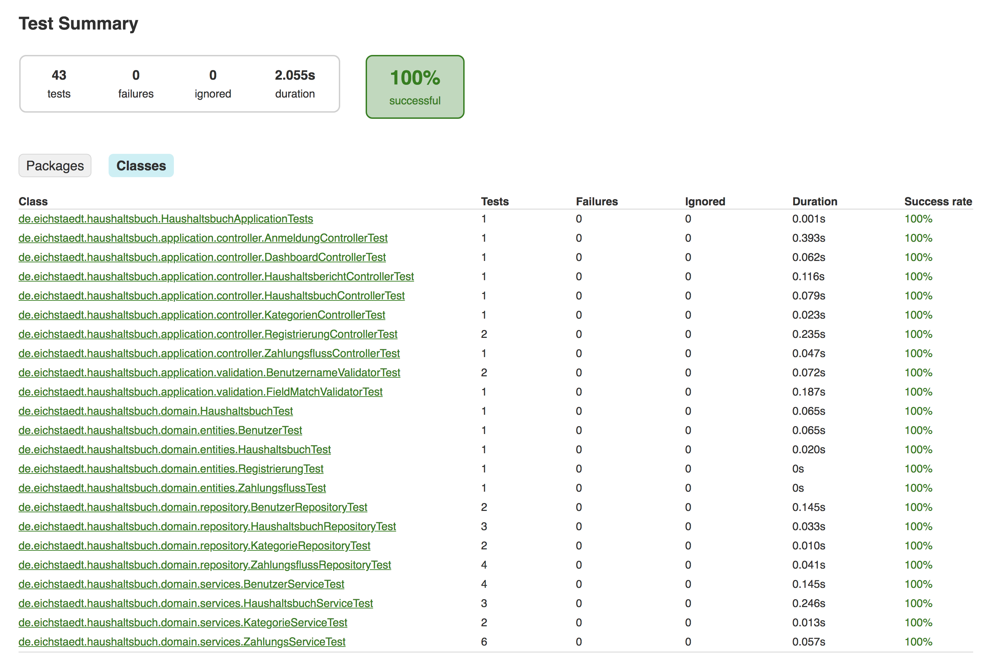

# Anwendung zur Führung eines Haushaltsbuches

# Inhaltsverzeichnis #
[1. Einführung und Ziele ](#1-einf%C3%BChrung-und-ziele) 
[1.1 Aufgabenstellung](#11-aufgabenstellung) 
[1.2 Qualitätsziele ](#12-qualit%C3%A4tsziele) 
[1.3 Projektbeteiligte ](#13-projektbeteiligte-stakeholder)        
[2. Randbedingungen ](#2-randbedingungen) 
[3. Kontextabgrenzung](#3-kontextabgrenzung) 
[4. Lösungsstrategie](#4-l%C3%B6sungsstrategie) 
[5. Baustein](#5-bausteinsicht) 
[6. Laufzeitsicht](#6-laufzeitsicht) 
[7. Verteilungssicht](#7-verteilungssicht) 
[8. Betrieb und Wiederherstellung](#8-betrieb-und-wiederherstellung) 
[8.1 Konfiguration](#8.1-konfiguration) 
[9. Entwurfsentscheidungen](#9-entwurfsentscheidungen) 
[10. Qualitätsziele](#10-qualit%C3%A4tsziele) 
[11. Risiken und technische Schulden](#11-risiken-und-technische-schulden) 
[12. Glossar](#12-glossar) 

# 1. Einführung und Ziele #
Zielstellung dieser Anwendung ist es Anwendern das Erstellen eines gemeinsam zu nutzenden Haushaltbuches zur Eingabe aller finanziellen Ausgaben und Einnahmen zu ermöglichen. Dazu soll es dem Anwender ermöglicht werden, alle Zahlungsflüsse eines Haushaltes digital zu erfassen und entsprechende Ein- und Ausgabekategorien zuordnen zu können. 
Anwender sollen mehrere Haushaltsbücher gleichzeitig führen können. Jeder Anwender soll anderen Anwendern es ermöglichen können, gemeinsam ein Haushaltsbuch zu führen. Haushaltsbücher anderer Anwender dürfen nur durch autorisierte Anwender eingesehen und verwaltet werden. 
Die Software soll über die eingegebenen Ausgaben und Einnahmen Berichte über bestimmte Zeiträume und Kategorien darstellen können. Dazu soll der Benutzer jeweils die Möglichkeit bekommen den Berichtszeitraum und eine zur Verfügung stehende Berichtsform wählen zu können. Alle zur Verfügung stehenden Kategorien der Einnahmen und Ausgaben müssen durch die Benutzer selbst erstellt und gepflegt werden können. 
Alle Benutzer sollen sich mit einem Benutzernamen und Passwort an dem System authentifizieren. Die Softwareanwendung soll in einem Web Browser aufgerufen und gesteuert werden können. Dabei sollen die derzeit aktuellen Versionden der Browser Chrome und Firefox unterstützt werden. 

## 1.1 Aufgabenstellung ##

Die Aufgabenstellung für das Entwicklungsteam ist es, die im Pflichtenheft definierten Anforderungen in Form einer installierbaren und ausführbaren Anwendung umzusetzen. Dazu sollen die notwendigen Technologien 
ausgewählt, die Konzeption der Anwendung erstellt und die Umsetzung durchgeführt werden.  

## 1.2 Qualitätsziele ##
Folgende nicht funktionale Anforderungen müssen bei Implementierung der Anwendung berücksichtigt werden. 

**Wartbarkeit**
Die Software soll schnell und einfach an neue Anforderungen angepasst werden können. Dazu sollen die bestehenden Anwendungen durch automatisierte Tests geprüft werden, sodass bei 
durchzuführenden Änderungen die Sicherheit besteht bereits bestehenden Funktionalitäten nicht beeinflusst zu haben.

**Usability / Gebrauchstauglichkeit**
Die Software soll einen hohen Grad an Gebrauchtstaglichkeit aufweisen. Das bedeutet, dass der Nutzer seine Ziele effizient, effektiv und mit einem hohen Grad an Zufriedenheit mit Hilfe der Software erreichen kann. Die Kriterien der Gebrauchstauglichkeit sind in der ISO 9241 festgehalten.  

## 1.3 Projektbeteiligte (Stakeholder) ##
Die Bedürfnisse folgender Projektbeteiligter sind zu berücksichtigen: 

* **Anwender:** Die Nutzerbedürfnisse und Ziele können durch eine mögliche Anwenderbefragungen im Vorfeld oder durch Anwendertests herausgearbeitet werden. 
* **Administratoren / IT - Betrieb:** Die Anforderungen an den Betrieb der Anwendung müssen berücksichtigt werden. Die Anwendung soll auf einem Server mit dem Betriebssystem Windows Server bzw. Debian Linux installiert werden können. Die Anwendung soll im Internet verfügbar gemacht werden können.
* **Entwicklungsteam:** Aufgrund der Vorkenntnisse und der bereits aus anderen Projekten bestehenden Erfahrungen bei der Umsetzung ähnlicher Projekte, soll das Projekt mit Hilfe der Java Enterprise / Spring Framework Technologie umgesetzt werden.
  
# 2. Randbedingungen
Für die Anwendungsentwicklung stehen ca. 6 Monate zur Verfügung. Aufgrund personeller Schwierigkeiten im Bereich der Entwicklung besteht das Entwicklungsteam nur aus einer Person. 
# 3. Kontextabgrenzung

Die Anwendung ist als eine Web Serveranwendung umgesetzt, welche HTML Seiten auf Browseranfragen des Nutzers ausliefert. Die Anwendung selbst wird in einem Tomcat Anwendungserver installiert und ausgefürt. Die Anwendung kann mit Hilfe einer ausführbaren JAR Datei gestartet werden.    
Zusätzlich wird diese Anwendung in einem isolierten [Docker](https://www.docker.com/) Container ausgeführt. Mit Hilfe der Docker Technologie kann die Anwendung einfach gestartet und gestoppt und in verschiedenen Versionen ausgeführt werden.  
Alle Daten der Anwendung werden in einer relationalen Datenbank gespeichert. Als Datenbankmanagementsystem (DBMS) wurde die Software [Postgres](https://www.postgresql.org/) ausgewählt. Auch das DBMS wird in einem Docker Container ausgeführt. Beide Docker Container werden 
gemeinsam mit Hilfe der Docker Compose Technologie gemeinsam ausgeführt und in einem Docker Netzwerk verbunden. Alle Docker und Docker Compose Konfigurationsdateien sind im Softwareprojekt enthalten. 

Folgende Abbildung veranschaulicht den gesamten Kontext der Anwendung: 

 

Wie bereits beschrieben, kann der Nutzer die Anwendung im Internet aufrufen. Dazu muss der Anwendungsserver über einen DNS Namen im Internet erreichbar sein. Alle Nutzerdaten werden nach Eingabe 
in der Postgres Datenbank gespeichert.
# 4. Lösungsstrategie

Die Anwendung Haushaltsbuch wurde mit Hilfe folgender Software Technologien umgesetzt: 

  * [Java 8](https://www.oracle.com/de/java/index.html) 
  * [Spring Boot 2](https://spring.io/projects/spring-boot)
  * Spring Data, Spring Web MVC, Thymeleaf HTML Template Engine, Spring Security 
  
Als Laufzeitumgebung wurde der Anwendungsserver Tomcat in der embedded Version von Spring Boot ausgewählt. Spring Boot ermöglicht den Berieb einer Anwendung als sogenanntes [Self-Contained System](https://scs-architecture.org/). Das bedeutet, dass im Rahmen des Build Prozesses ein installierbares Softwareartefakt, in diesem Fall eine JAR Datei, 
erstellt wird, welche alle notwendigen Bestandteile und Konfigurationen für den Betrieb enthält. So wird zum Beispiel beim ausführen der JAR Datei der embedded Tomcat Anwendungserver bereits fertig konfiguriert gestartet. 
Diese Vorgehensweise macht eine aufwendige und komplizierte Installation und Konfiguration auf einem Server überflüssig, sodaß eine permanente, wiederholbare Installation nach Phasen der Entwicklung der Anwendung durchgeführt werden kann. 

Als Build Tool wurde in diesem Projekt [Gradle](https://gradle.org/) verwendet. Gradle ermöglicht es über eine Build Konfigurationsdatei den Java Build Prozess zu steuern und durchzuführen. Gradle bietet weiterhin viele Plugings, 
um den Build Prozess an die eigenen Bedürfnisse anzupassen. Es wurde zum Beispiel in diesem Projekt das Docker Plugin für das Erstellen des Docker Containers verwendet. Der Build Vorgang kann 
mit folgendem Befehl gestartet werden: 

    gradle build docker

Zusätzlich kann des Build Script mit Hilfe der Programmiersprache [Groovy](https://gradle.org/) umfangreich beeinflusst werden. 

Zur Ablage der Daten ist das Datenbankmanagementsystem Postgres ausgewählt wurden. Mit Hilfe des Frameworks Spring Data, welches als Object Releational Mapper (ORM) eingesetzt ist, werden die 
Daten direkt aus den Java Klassen heraus geladen und gespeichert. 

Für die Darstellung der HTML Seiten sind folgende Technologien verwendet worden: 

  * HTML 5 
  * CSS 3 & [Bootstrap 4.0.0](https://getbootstrap.com/) Framework
  * Javascript ECMA 6 
  * [JQuery 3.2.1](https://jquery.com/) Framework
  * [JQPlot 2](http://www.jqplot.com/) 

Alle Seiten folgen dem Ansatz des Responsive Design. Als allgemeine Entwicklungsrichtlinien wurden folgende Prinzipien angewendet: 

  *  [Test Driven Development](https://www.it-agile.de/wissen/agiles-engineering/testgetriebene-entwicklung-tdd/) 
  *  [Clean Code](http://clean-code-developer.de/)
  *  [Domain Driven Design, DDD](http://dddcommunity.org/)
   
# 5. Bausteinsicht

Die Anwendung ist in einer 3 Schichten Architektur umgesetzt worden. Alle Klassen und Pakete sind dabei in folgende Schichten aufgeteilt worden: 

  1. **Application Layer**: Diese Schicht enthält alle Klassen zur Verwaltung der Darstellung. Die Umsetzung der HTML Ansichten ist nach dem Design Pattern "Model View Controller (MVC)" umgesetzt. Dies bedeutet, dass die Daten der HTML Seiten im Model verwaltet werden, 
                 die Steuerung der Aktivitäten innerhalb der HTML Seiten über die Controller umgesetzt wird und mit Hilfe der View die HTML Ansichten erzeugt werden. Das MVC Pattern wird bereits durch das Spring Framework Spring Web MVC umgesetzt und unterstützt.
  2. **Domain Layer**: Diese Schicht enthält alle Klassen zur Steuerung der Anwendungsdaten und Prozesse. Die Klassen sind nach dem Ansatz des operativen Design aus dem Konzept des [Domain Driven Design](http://dddcommunity.org/) realisiert worden. 
  3. **Infrastructure Layer**: Diese Schicht enthält alle Klassen zur Steuerung und Verwaltung der Infrastrukturkomponenten. Dazu zählt die Konfiguration des Anwendungsframeworks Spring Security und Spring Web MVC. 

Die Aufteilung der Anwendung in diese Schichten bietet folgende Vorteile: 

  * Struktur ist übersichtlich und leicht verständlich, 
  * eine Schicht kann einfach ausgetauscht werden. 
  * eine Schicht ist gut testbar. 
   
Folgene Abbildung zeigt die Struktur der Anwendung: 

               

In der obersten Schicht wird die komplette Darstellung mit Hilfe des Frameworks Spring MVC realisiert. Folgende Abbildung zeigt eine Beispiel MVC Architektur: 

In diesem Projekt wird die View mit Hilfe des HTML Template Frameworks [Thymeleaf](https://www.thymeleaf.org/) realisiert. Dazu ist es notwendig, für alle HTML Seiten die HTML Thymeleaf Template Dateien 
im Ordner **src/main/resources/templates** abzulegen. Darin wird der Aufbau jeder Seite in HTML beschrieben und um die sogenannte Expression Language von Thymeleaf erweitert. Folgende Templates wurden für dieses Projekt angelegt: 

  *   anmeldung.html: Zeigt ein Anmeldeformular für die Nutzerauthentifizierung
  *   dashboard.html: Auf dieser Seite kann der Nutzer ein Haushaltsbuch und Kategorien anlegen. Weiterhin erhält er eine Übersicht über alle seine Haushaltsbücher und kann diese dar heraus öffnen. 
  *   haushaltsbericht.html: Diese Seite zeigt zwei Berichte zu einem Haushaltsbuch.
  *   haushaltsbuch.html: Diese Seite zeigt die Details eines Haushaltsbuches und ermöglicht die Eingabe von Einnahmen und Ausgaben. 
  *   registrierung.html: Diese Seite stellt ein Formular zur Abfrage von Nutzerdaten zur Verfügung über welches sich der Nutzer registrieren kann 
  *   registrierungserfolg.html: Zeigt einen Dialog zur Bestätigung der erfolgreichen Registrierung. Im Dialog gibt es einen Aktivierungslink um eine Anmeldung zu ermöglichen.
  *   registrierungsfehler.html: Zeigt mögliche Fehler des Registrierungsprozesses. 
  *   navigation.html: In dieser Datei wird lediglich ein Teilfragment der Gesamtdarstellung beschrieben. Hier wird die zentrale Navigationskomponente beschrieben, welche durch die anderen Seiten eingebunden wird. 
  *   base.html: Enthält Teilfragmente für die Seite haushaltsbuch. 
  *   aktivierungserfolg.html: Stellt einen Dialog zur Bestätigung des erfolgreichen Aktivierungsprozesses dar. 
  *   aktivierungsfehler.html: Zeigt mögliche Fehler des Aktivierungsprozesses. 
 
Für jede Seite gibt es jeweils eine entsprechende Spring MVC Controller Klasse. Die folgende Abbildung zeigt die Klassen des Controller Packages aus der Application Schicht: 

Für jede zentrale Anwendungsseite gibt es eine Spring Web MVC Controller Klasse. Diese stellt die Schnittstelle zwischen dem Model und der View im MVC Pattern dar. Darüber wird die Auslieferung der 
HTML Template Seite als Antwort auf einen HTML GET oder POST Request gesteuert. 
Zur Ausführung der entsprechenden Geschäftlogik wird jeweils ein entsprechendes Interfaces, der sogenannte Entity Boundary Controller, verwendet. Diese Schnittstelle stellt die
Kopplung zwischen dem Application und dem Domain Layer dar. Diese Architektur entkoppelt die Darstellung von der Geschäftslogik und ermöglicht es die Darstellungsschicht auch später noch einmal einfach austauschen zu können. So 
nutzt zum Beispiel der KategorienController der Application Schicht den KategorienBoundaryController, um Kategorien anzulegen oder sich alle Kategorien als Liste ausgeben zu lassen. Dadurch, dass der KategorienController diese Aktionen auf einem Interface ausführt,
besteht keine Kopplung zu einer konkreten Implementierung. Alle Abhängigkeiten und das Erzeugen der konkreten Implementierung wird über das Spring Dependency Injection Management erzeugt. Um eine Abhängigkeit verwenden zu können, ist lediglich folgender Code notwendig: 

      @Autowired
      private KategorieBoundaryController kategorieBoundaryController;

Dieser Code und die Autowired Annotation wird vom Spring Dependency Injection Framework ausgewertet und eine entsprechende Instanz vom Type des Interfaces zur Verfügung gestellt. Um den kompletten Lebenszyklus der entsprechenden Instanz kümmert sich die Laufzweitumgebung. 
Diese Art der Kopplung zwischen der Darstellungsschicht und der Geschäftlogik wurde für alle weiteren Controller analog verwendet. So enthalten alle Boundary Controller Interfaces die Beschreibung aller fachlichen Anwendungsfälle. 

Alle weiteren Packages des Domain Layers enthalten die Klassen nach dem Konzept des Domain Driven Design (DDD). Das operative Design des DDD kennt dabei folgende Gruppen von Klassen: 

  * **Entity**: Modelliert ein individuelles Ding. Jede Entity hat eine eindeutige Identität, anhand derer man Ihre Individualität von allen anderen Objekten unterscheiden kann. 
  * **Value Object**: Wertobjekt, modelliert ein unveränderliches konzeptionelles Ganzes. Innerhalb des Modells ist der Wert genau das: ein Wert. Im Gegensatz zur Entität besitzt es keine eindeutige Identität. 
  * **Aggregates**: Stellen eine sogenannte "root Entity" dar, welche mehrere Entities zusammenfasst. Ein Aggregate hat damit ebenfalls eine Identität und steuert die Kosistenz von mehreren Entitäten. 
  * **Repository**: Stellt eine Schnittstelle zu Persistenzschicht dar. Hierrüber werden die Daten gespeichert und verändert. 
  * **Service**: Steuern und kontrollieren einen Geschäftsprozess, welcher mehrere Entitäten bzw. Aggregates betrifft. 
  
In der nachfolgenden Abbildung sind die zentralen Klassen des fachlichen Modells aufgeführt. Diese sind das Haushaltbuch, der Zahlungsfluss, der Benutzer und die Kategorie. Jeder Benutzer kann mehrere Haushaltsbücher anlegen. In jedem Haushaltsbuch sind
jeweils die Ausgaben und Einnahmen als ein Set von Zahlungsfluss modelliert. 

   
   

Die nachfolgende Abbildung zeigt die Klassenstruktur des Domain Layers:  

Das erste Package controller enthält, wie bereits erläutert, die Schnittstelle zur oberen Darstellungsschicht. Im nachfolgenden Package domain.entities sind alle Entity Klassen des Haushaltbuch Projektes. Alle Entity Klassen sind zugleich Entitätsklassen im Sinne der Persitierung. 
Das bedeutet, dass alle Entity Klassen nach dem [Java Persistence API (JPA)](https://de.wikipedia.org/wiki/Java_Persistence_API) Standard annotiert sind. Mit Hilfe dieser Annotation kann das Spring Data Framework diese Klassen zur Persitierung in einer relationalen Datenbank verwenden. Folgender Quellcode zeigt dies am Beispiel des Haushaltbuches: 

    @Entity
    @Table(name = "haushaltsbuecher")
    public class Haushaltsbuch {
    
      protected Haushaltsbuch() {
      }
    
      public Haushaltsbuch(String name, Benutzer besitzer) {
        this.name = name;
        this.erstellDatum = LocalDate.now();
        this.ausgaben = new HashSet<>();
        this.einnahmen = new HashSet<>();
        this.besitzer = besitzer;
      }
    
      @Id
      @GeneratedValue(strategy = GenerationType.SEQUENCE)
      @Column(name = "id")
      private Long id;
    
      @Column(name = "name")
      private String name;
    
      @Column(name = "erstelldatum")
      private LocalDate erstellDatum;
    
      @OneToMany
      @JoinTable(name = "haushaltsbuch_ausgaben" ,joinColumns = @JoinColumn( name="zahlungsfluss_id"),
          inverseJoinColumns = @JoinColumn( name="haushaltsbuecher_id"))
      private Set<Zahlungsfluss> ausgaben;
    
      @OneToMany
      @JoinTable(name = "haushaltsbuch_einnahmen",joinColumns = @JoinColumn( name="zahlungsfluss_id"),
          inverseJoinColumns = @JoinColumn( name="haushaltsbuecher_id"))
      private Set<Zahlungsfluss> einnahmen;
    
      @ManyToOne(fetch = FetchType.EAGER)
      @JoinColumn(name = "besitzer_id", foreignKey = @ForeignKey(value = ConstraintMode.CONSTRAINT,name = "haushaltsbuch_besitzer_foreignkey"))
      private Benutzer besitzer;

Um eine Klasse als JPA Entität zu kennzeichnen, sind lediglich die Annotation @Entity und @Id notwendig. Alle anderen Annotationen dienen dazu, die konkrete Umsetzung der Klassenattribute auf relationale Tabellen und Tabellenbeziehungen zu steuern. 
Die sich in diesem Package befindenden Entitäten werden durch die Repositories domain.repository Package gespeichert. Allerdings befinden sich hier nur Interfaces, wie am folgenden Beispiel aufgeführt ist: 

    public interface HaushaltsbuchRepository extends CrudRepository<Haushaltsbuch,Long> {
    
      List<Haushaltsbuch> findByBesitzerBenutzername(String benutzername);
    
    }

Dieses Haushaltsbuch Repository Interface beschreibt ein vollständiges Repository Interfaces, um eine Haushaltsbuch Entität speichern, aktualisieren und löschen zu können. Die Implementierung dieses Repositories wird durch das Framework 
[Spring Data](http://projects.spring.io/spring-data/) zur Verfügung gestellt. Dadurch, dass das Interface HaushaltsbuchRepository das CrudRepository von Spring Data erweitert können, zum einen die Standards CRUD (Create Read Update Delete) Operationen genutzt und zum Anderen eigene Methoden hinzugefügt werden. 
Ein weiterer Vorteil der Verwendung dieses Frameworks ist, dass die Auswahl des relationalen DBMS verändert werden kann, ohne dass der Quellcode angepasst werden muss. Um von der derzeitigen Postgres Implementierung auf eine MYSQL zu wechseln, sind lediglich einige Konfigurationswerte in der Spring applicaion.properties Datei anzupassen. Im Abschnitt Installation und Konfiguration wird diese kurz beschrieben. 

Alle Service Klassen im Package domain.services implementieren die entsprechenden Boundary Controller Interfaces. Aufgrund der Annotation @Component und der Tatsache, das keine weitere Implementierung im Klassenpfad des Projektes existiert, 
kann Spring via Dependency Injection die Serviceklassen erzeugen und zuweisen. 

Im Package domain.valueobjects befinden sich einige Werteobjekte, welche im Rahmen der Geschäftlogik benötigt werden und keine Entitäten im Sinne des DDD darstellen. Die Klasse Adresse 
ist zum Beispiel lediglich solch ein Werteobjekt ohne eigene Identität bzw. Lebenszyklus. Wird diese einmal mit speziellen Werten erzeugt, kann diese nicht mehr verändert werden, da keine entsprechenden Setter Methoden implementiert sind.    

In der untersten Schicht werden einige Spring Infrastrukturkonfigurationen vorgenommen. Folgende UML Darstellung zeigt die Klassenstruktur: 

Diese Klassen ermöglichen die Anpassung der Standardkonfiguration der Frameworkkomponenten [Spring Web MVC](https://docs.spring.io/spring-framework/docs/current/spring-framework-reference/web.html#spring-web) und [Spring Security](https://docs.spring.io/spring-security/site/docs/5.0.5.BUILD-SNAPSHOT/reference/htmlsingle/).
Alle Details der Anpassungen sollen hier nicht beschrieben werden, können aber in der entsprechenden Framework Dokumentation nachvollzogen werden.    
# 6. Laufzeitsicht

Die nachfolgende Abbildung zeigt die zentralen Komponenten der Anwendung zur Laufzeit. 

Im ersten Schritt gibt der Nutzer eine HTTP Anfrage mit Hilfe des Browsers ein. Hierbei verwendet er die URL des installierten Anwendungsservers. Zum jetzigen Zeitpunkt ist das der in Spring Boot eingebettet Tomcat Server. Dieser leitet die Anfrage an das zentrale Dispatcher Servlet weiter. 
Im selben Augenblick werden die zur weiteren Verarbeitung benötigten Spring MVC Bean Komponenten erzeugt. Dieser erarbeiten den HTTP Request und erzeugen eine entsprechende Antwort. Für den Fall, dass Daten aus der Datenbank abgefragt werden, müssen auch die entsprechenden Spring Data JPA Kompoenten erzeugt werden. 
Diese generieren auf Basis einer JPA Implementierung, in diesem Fall Hibernate, eine SQL Anfrage welche durch den Postgres Server beantwortet werden muss. Sobald diese beantwortet ist, werden die Daten via OR Mapping in die Bean Komponenten übertragen und zur Weiterverarbeitung des Requests verwendet. Die MVC Komponente überträgt diese Daten 
dann in das Model der View, sodass der Nutzer eine entsprechende HTTP Antwort erhält. 

# 7. Verteilungssicht
# 8. Betrieb und Wiederherstellung #

Diese Anwendung wurde als Serveranwendung entwickelt. Aufgrund der Kapselung in einem Docker Container kann, diese Anwendung auf jedem Betriebssystem betrieben werden, für welche Docker zur Verfügung gestellt wird.  

Die Installation der Anwendung kann wie folgt durchgeführt werden: 

  [Installation Docker](https://www.docker.com/community-edition#/download) 
  
  [Installation Java SDK 8](http://www.oracle.com/technetwork/java/javase/downloads/jdk8-downloads-2133151.html)
  
  [Download aller Quelle](https://github.com/eichstaedtk/haushaltsbuch)
    
  Wechsel in das Quellcodeverzeichnis 
    
  Installation des Postgres Containers mit: 
    
    docker build -f DockerfilePostgres . -t eg_postgresql:latest
    
  Installation des Haushaltbuches Containers mit: 
    
    gradlew build docker
    
  Starten der Anwendung
  
    docker-compose -d up
    
    bzw. 
    
    docker-compose -d start
    
  Stoppen der Anwendung
  
    docker-compose stop

# 8.1 Konfiguration #

Die Anwendung kann mit Hilfe von Umgebungsvariablen oder einer Konfigurationsdatei des Spring Frameworks konfiguriertw werden. Mit Hilfe des Frameworks Spring Cloud ist es sogar möglich, die Konfigurationsdateien
in ein Git Repository auszulagern. Das Spring Framework unterstützt auch die Verwendung unterschiedlicher Konfigurationsdateien für unterschiedliche Profile. So können zum Beispiel Konfigurtionswerte für 
Laufzeitumgebungen für Test, Produktion oder Continuous Integration zu setzen. In diesem Projekt werden nur zwischen dem Standardprofil und dem produktiven Profil unterschieden. 

Um zum Beispiel die Datenbankverbindung zur Postgres Datenbank zu konfigurieren sind folgende Werte in der applications.properties gesetzt: 

     spring.datasource.url=jdbc:postgresql://postgres:5432/haushaltsbuch
     spring.datasource.username=docker
     spring.datasource.password=docker
     spring.datasource.driver-class-name=org.postgresql.Driver
     spring.jpa.hibernate.ddl-auto=update
     
Die ersten drei Werte sind Verbindungsparameter der JDBC Verbindung. Der 4 Wert setzt die zentrale Treiberklasse und der letzte Wert veranlasst das JPA Framework zur automatischen Aktualisierung der Postgres Datenbank falls notwendig. 

# 9. Entwurfsentscheidungen
Folgende Entwurfsentscheidungen sind in diesem Projekt getroffen worden: 

  * Einsatz von Java: Gründe dafür waren die Vorkenntnisse im Entwicklungsteam und die Plattformunabhängigkeit durch die Java Virtual Machine. 
  * Einsatz des Spring Framework: Hauptgrund für die Auswahl diese Frameworks war die Möglichkeit der schnellen Entwicklung einer einfach zu installierenden Web Anwendung. Durch die Komponente Spring Boot ist die Anwendung bereits lauffähig vorkonfiguriert und kann aber in allen Details angepasst werden.  
  * Einsatz von Docker: Grund dafür war die einfache und plattformunabhängige Möglichkeit der Installation von Datenbank und Anwendung
                 
# 10. Qualitätsziele

Um die Qualität einzelner Softwarekomponenten sicherzustellen, wurden Unit und Integrationstests implementiert. Die Spring Testing Komponente des Frameworks ermöglicht es, sehr einfach Tests zu schreiben 
welche Zugriff auf die komplette Laufzeitumgebung und Persistenzschicht haben. Es können ebenfalls auch sehr einfach Tests für das Aufrufen einzelner Seiten implementiert werden.  
Alle Tests werden mit jedem Build der Anwendung vollständig durchgeführt. Dabei erstellt Gradle für jeden Build einen Bericht in folgenden Formaten: 

   * HTML
   * XML
   * Binary Format
   
Der Bericht als HTML Seite wird in folgendem Verzeichnis abgelegt: **/build/reports/tests/test/index.html. Mit folgendem Befehl kann aus dem Projektverzeichnis heraus der Bericht erzeugt werden: 

    gradle clean test

Der Bericht vom 15.07.2018 ist in folgender Abbildung zu sehen: 

# 11. Risiken und technische Schulden
# 12. Glossar